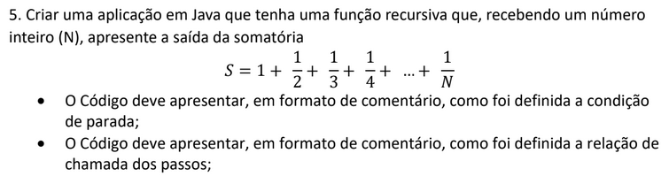

# Estrutura de Dados - Exercício 05 - Recursividade

Exercício de Recursividade para a matéria de Estrutura de Dados do curso de Análise e Desenvolvimento de Sistemas da FATEC Zona Leste

## Enunciado

## Utilização

Clone o repositório na sua máquina local, ou baixe o Zip (clicando em Code -> Download ZIP) e extraia a pasta. Importe o projeto na IDE Eclipse (File -> Open Projects from File System... -> Escolha a pasta do projeto), e execute o programa (Shift + F11 para execução normal, e F11 para debug).
